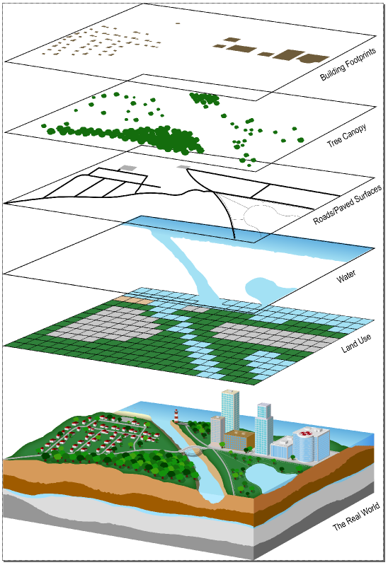
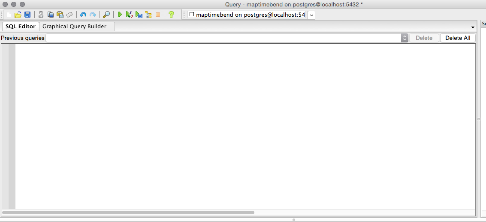
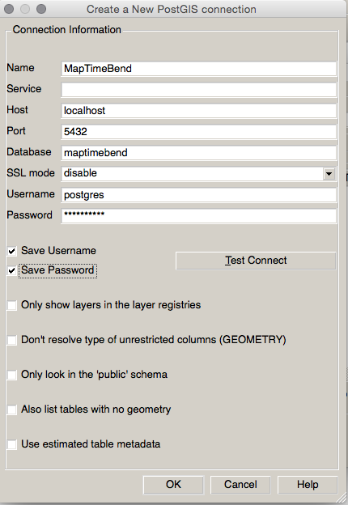
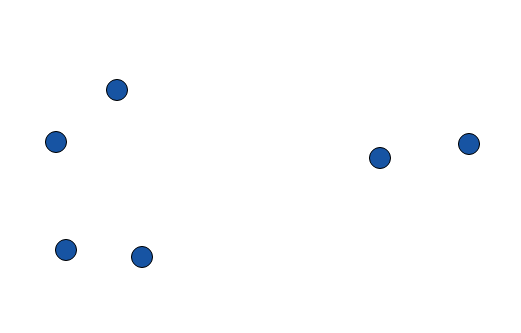
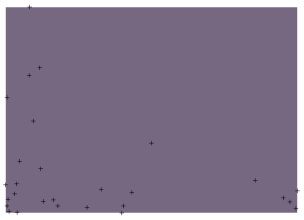
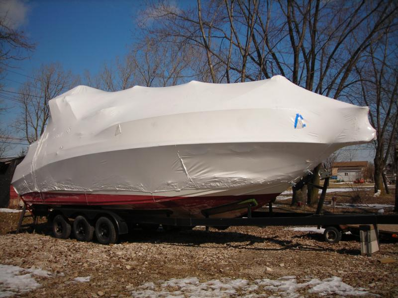
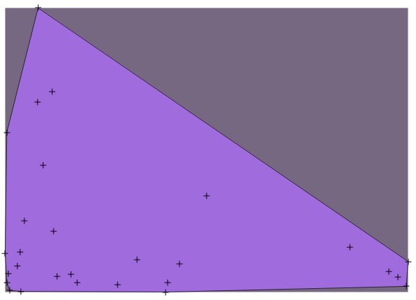
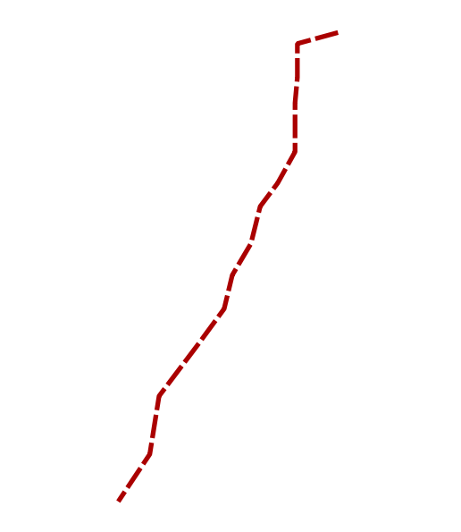
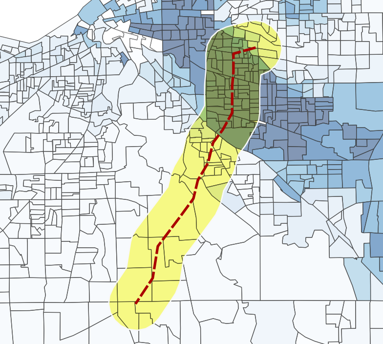

PostGIS-101
===========

What is PostGIS?

---

PostGIS is a _spatial_ database.

---

Meaning,

---

it _stores_ spatial data

---

e.g.
* where are all the police stations?
* what is the temperature across the city?
* what are the boundaries of the police wards?
* where are all the ice cream parlors?

---

but also allows for the analysis of spatial data

---

e.g.
* What are the 2 closest ice cream shops to each police station?

---

Spatial & non-spatial data can be analysed at the same time

---

* What is the most cost effective ice cream shop given ice cream prices, driving distance, and current gas prices relative to each police station?

---

And the analyses are _web scale_

---

It handles vector and raster data as abstractions (or images) of the real world.

---



---

And it's PostGIS uses SQL, so if even if you don't know SQL, you should be able to find lots of folks who do.

---
```sql
SELECT superhero.name
FROM city, superhero
WHERE ST_Contains(city.geom, superhero.geom)
AND city.name = 'Gotham';
```
---
##Let's Use pgAdmin

[pgAdmin](http://www.pgadmin.org/) is a free Open Source database management tool used to administer a PostgreSQL database instance. Let's do some basic work in it.  We'll make some random xy values and turn them into points:

1) Launch pgAdmin<br>
2) Connect to the database you are using for this MapTime lesson<br>
3) Open a new SQL window<br>


---
```sql
-- cleanup
DROP TABLE IF EXISTS xyz CASCADE;
-- create a table
CREATE TABLE xyz
(
x DOUBLE PRECISION,
y DOUBLE PRECISION,
z DOUBLE PRECISION
)
WITH (OIDS=FALSE);
-- Add a primary key
ALTER TABLE xyz ADD COLUMN gid serial;
ALTER TABLE xyz ADD PRIMARY KEY (gid);
```
---

Insert some data

---
```sql
INSERT INTO xyz (x, y, z)
VALUES (random()*100, random()*12, random()*56);

INSERT INTO xyz (x, y, z)
VALUES (random()*12, random()*56, random()*25);

INSERT INTO xyz (x, y, z)
VALUES (random()*56, random()*25, random()*100);

INSERT INTO xyz (x, y, z)
VALUES (random()*25, random()*100, random()*12);
```
---
```sql
-- cleanup before creating view
DROP VIEW IF EXISTS xbecausez;
```

---

And now we'll create a spatial view that makes all our xyz values into points.

---

```sql
CREATE VIEW xbecausez AS
SELECT gid, x, y, z, ST_SetSRID(ST_MakePoint(x,y), 4326) AS geom
FROM xyz;
```
---

Voila!

---

##Now how do we view our spatial data???

* [QGIS](http://www.qgis.org/en/site/)
* [ArcGIS Desktop] (http://www.esri.com/software/arcgis/arcgis-for-desktop)
* And more

###Viewing Data in PostGIS

* Launch QGIS
* Click on the 'Add PostGIS layer' button in the Manage Layers list<br>

* Establish a new PostGIS database connection<br>

* Connect to the database and add the new view we created named xbecausez

Now if we get new points with just xyz values, but no spatial information, those will automatically become spatial!

---

```sql
INSERT INTO xyz (x, y, z)
VALUES (random()*100, random()*12, random()*56);

INSERT INTO xyz (x, y, z)
VALUES (random()*12, random()*56, random()*25);

INSERT INTO xyz (x, y, z)
VALUES (random()*56, random()*25, random()*100);

INSERT INTO xyz (x, y, z)
VALUES (random()*25, random()*100, random()*12);
```
---



---

Cool, points on a map that auto-update.  Useful, but let's go deeper.  First add a whole lot more points.

---

```sql
INSERT INTO xyz (x, y, z)
VALUES (random()*100, random()*12, random()*56);

INSERT INTO xyz (x, y, z)
VALUES (random()*12, random()*56, random()*25);

INSERT INTO xyz (x, y, z)
VALUES (random()*56, random()*25, random()*100);

INSERT INTO xyz (x, y, z)
VALUES (random()*25, random()*100, random()*12);

--...
```

---

What is the overall shape of my points? I could calculate the box they fit into.

---

We'll directly create a table this time (rather than a view).

---
```sql
DROP TABLE IF EXISTS envelope;
CREATE TABLE envelope AS
WITH pointz AS
	(
	SELECT x, y, z, ST_SetSRID(ST_MakePoint(x,y), 4326) AS geom FROM xyz
	),
collectionz AS
	(
	SELECT ST_Union(geom) AS unioned FROM pointz
	),
extentz AS
    (
    SELECT ST_Extent(unioned)::geometry AS geom FROM collectionz
    )
SELECT 1 AS id, geom FROM extentz;
```

---



---

Let's refine that shape a bit with something called a convex hull.  This will shrink-wrap our points in a polygon.

---

Kind of like a 2D version of a shrink-wrapped boat:

---



---

```sql
DROP TABLE IF EXISTS hull;

CREATE TABLE hull AS
WITH pointz AS
	(
	SELECT x, y, z, ST_SetSRID(ST_MakePoint(x,y), 4326) AS geom FROM xyz
	)
,collectionz AS
	(
	SELECT ST_Union(geom) AS unioned FROM pointz
	)
,extentz AS
    (
    SELECT ST_ConvexHull(unioned)::geometry AS geom FROM collectionz
	)
SELECT 1 AS id, geom FROM extentz;
```
---



---

Ok, let's go further and use some real data. 

Suppose we have a proposed trail alignment:

---



---

For this trail alignment we want to know the demographics within a mile of the trail:

---



---

Now let's load our datasets into PostGIS.  We have a the trail alignment, trail_alignment_proposed.shp, for convenience, the buffered shape, trail_alignment_proposed_buffer.shp, and our census data that we want to summarize.

```BASH
shp2pgsql -s 3734 -d -i -I -W LATIN1 -g the_geom census trail_census | psql -U me -d postgis-101
shp2pgsql -s 3734 -d -i -I -W LATIN1 -g the_geom trail_alignment_proposed_buffer trail_buffer | psql -U me -d postgis-101
shp2pgsql -s 3734 -d -i -I -W LATIN1 -g the_geom trail_alignment_proposed trail_alignment_prop | psql -U me -d postgis-101
```

---

To get our demographics summarized, we need a function that calculates the proportion of each census block group that lays within our buffered trail. Fortunately, we can write that function as follows:

---


```sql
CREATE OR REPLACE FUNCTION proportional_sum(interpoly geometry, sumpoly geometry, sumnum double precision)
RETURNS double precision AS
$BODY$

WITH iintersection AS
	(
	SELECT ST_Intersection(interpoly, sumpoly) AS geom
	),

-- area of intersected geometry
intarea AS
	(
	SELECT ST_Area(geom) AS intarea FROM iintersection
	),

-- area of input geometry for the proportion calculation
sumarea AS
	(
	SELECT ST_Area(sumpoly) AS sumarea
	),

-- now calculate the proportion of the intersection to the original geometry
proportion AS
	(
	SELECT intarea / sumarea AS proportion FROM
		intarea CROSS JOIN sumarea
	)

-- finally use that proportion to scale the input number
SELECT sumnum * proportion FROM proportion;
$BODY$
LANGUAGE sql VOLATILE;

```
---

And now let's calculate our population:

---

```sql
WITH proportion AS
	(
	SELECT trail.gid, proportional_sum(trail.the_geom, census.the_geom, census.pop) AS populations FROM
		trail_buffer AS trail, trail_census as census
	WHERE ST_Intersects(trail.the_geom, census.the_geom)
	)
SELECT ROUND(SUM(populations)) AS population FROM proportion
	GROUP BY gid;

```
---

Result?

---

```sql
 population 
------------
      96081
(1 row)

```
---

Things we learned (and can study more):
* Creating spatial data from xy values
* Creating TABLES and VIEWS of data
* Creating functions to extend PostGIS functionality

---
